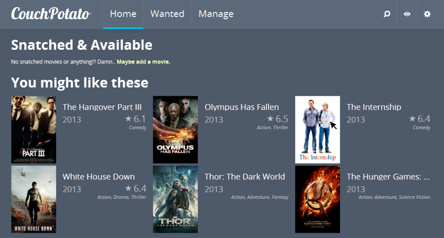

<!--
N.B.: This README was automatically generated by https://github.com/YunoHost/apps/tree/master/tools/README-generator
It shall NOT be edited by hand.
-->

# CouchPotato for YunoHost

[](https://dash.yunohost.org/appci/app/couchpotato)    
[](https://install-app.yunohost.org/?app=couchpotato)

*[Lire ce readme en français.](./README_fr.md)*

> *This package allows you to install CouchPotato quickly and simply on a YunoHost server.
If you don't have YunoHost, please consult [the guide](https://yunohost.org/#/install) to learn how to install it.*

## Overview

Download movies automatically, easily and in the best quality as soon as they are available.


**Shipped version:** 3.0.1~ynh4


## Screenshots



## Disclaimers / important information

* Integrates automatically with [transmission_ynh](https://github.com/YunoHost-Apps/transmission_ynh) (or tries to...),
* Integrates [YunoHost multimedia](https://github.com/YunoHost-Apps/yunohost.multimedia) folder structure

## Documentation and resources

* Official app website: <https://couchpota.to>
* Upstream app code repository: <https://github.com/CouchPotato/CouchPotatoServer>
* YunoHost documentation for this app: <https://yunohost.org/app_couchpotato>
* Report a bug: <https://github.com/YunoHost-Apps/couchpotato_ynh/issues>

## Developer info

Please send your pull request to the [testing branch](https://github.com/YunoHost-Apps/couchpotato_ynh/tree/testing).

To try the testing branch, please proceed like that.

``` bash
sudo yunohost app install https://github.com/YunoHost-Apps/couchpotato_ynh/tree/testing --debug
or
sudo yunohost app upgrade couchpotato -u https://github.com/YunoHost-Apps/couchpotato_ynh/tree/testing --debug
```

**More info regarding app packaging:** <https://yunohost.org/packaging_apps>
